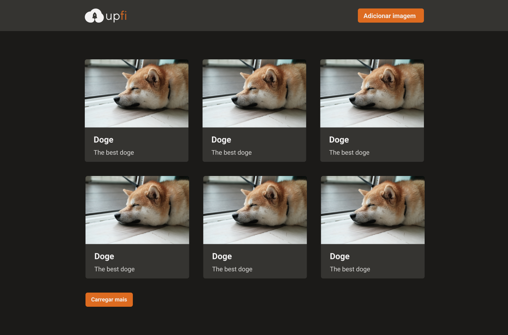
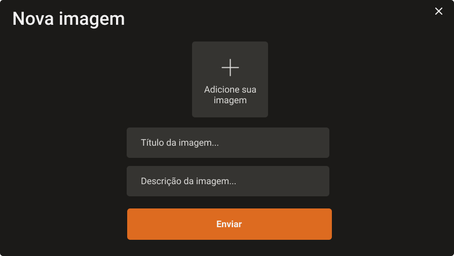
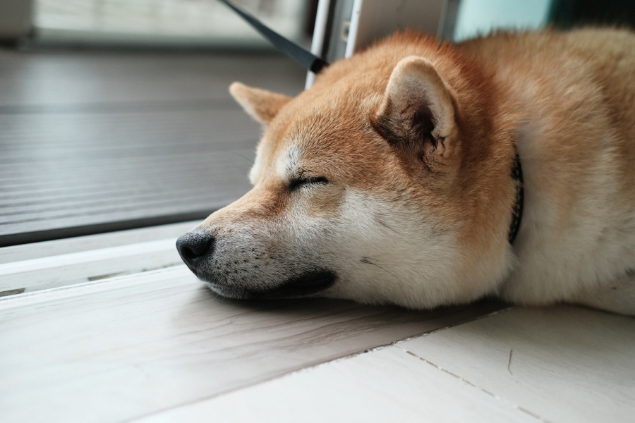
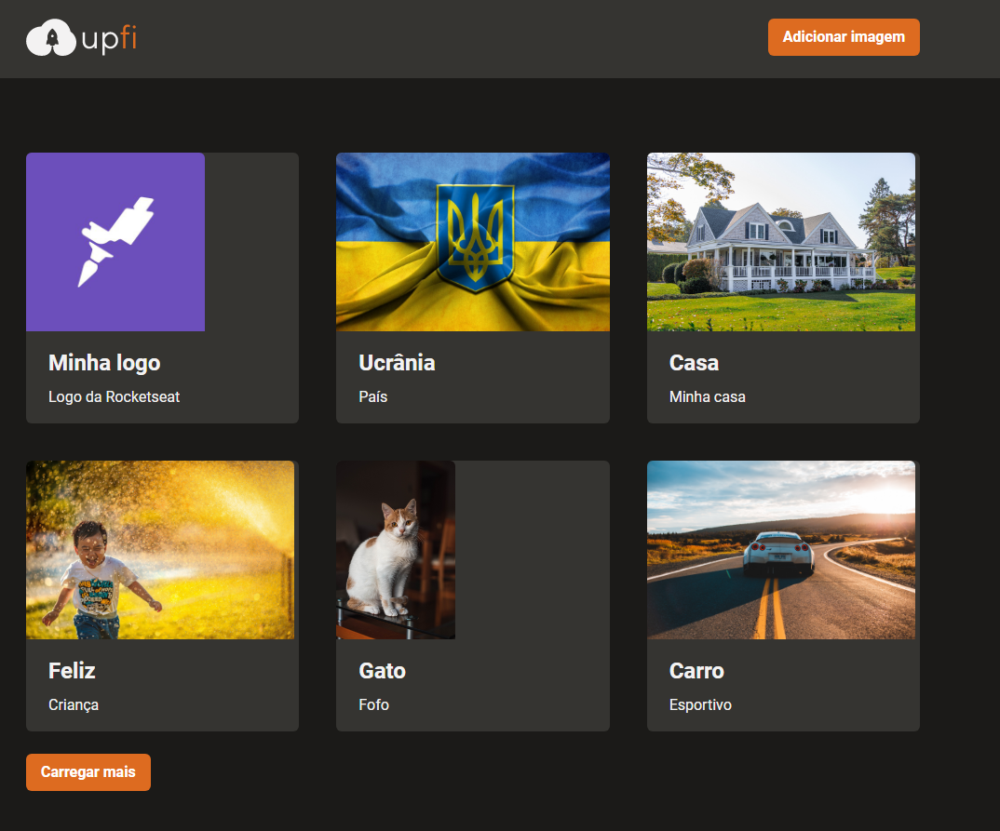
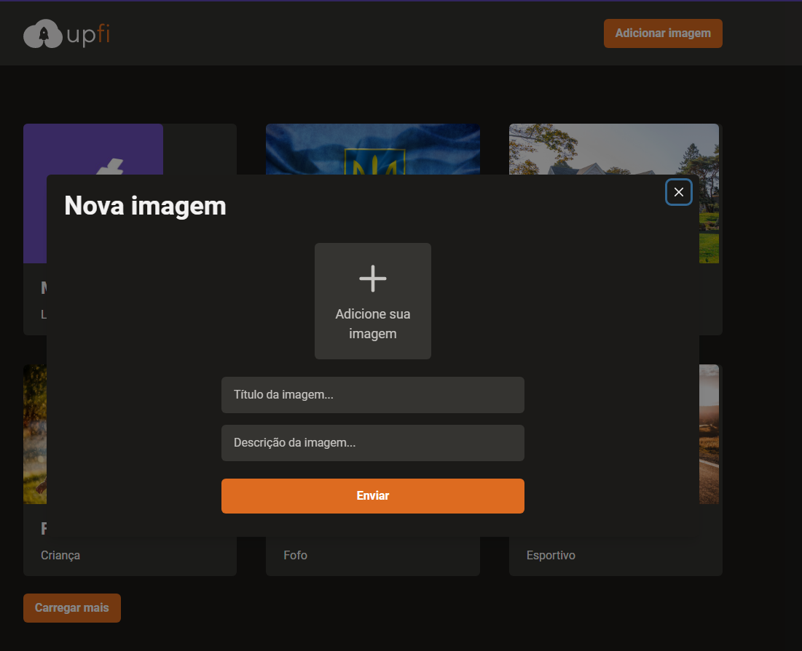
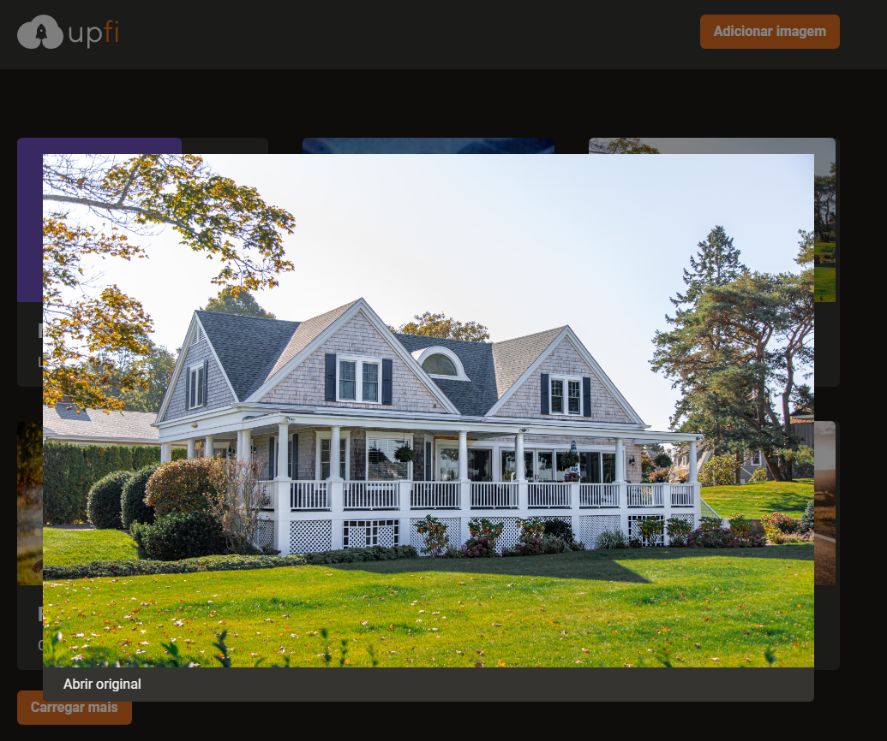

# Desafio 02 - Upload de imagens

<p align="center">


</p>

<br>

<p align="center"><em>Confira o resultado do desafio em: <a href="https://upfi-rocketseat-vitor.vercel.app" target="_blank">upfi-rocketseat-vitor.vercel.app</a></em></p>

## :computer: Sobre o desafio

<hr>

Nesse desafio, você deverá criar uma aplicação para treinar o que aprendeu até agora no ReactJS

Essa será uma aplicação onde o seu principal objetivo é adicionar alguns trechos de código para que a aplicação de upload de imagens funcione corretamente. Você vai receber uma aplicação com muitas funcionalidades e estilizações já implementadas. Ela deve realizar requisições para sua própria API Next.js que vai retornar os dados do FaunaDB (banco de dados) e do ImgBB (serviço de hospedagem de imagens). A interface implementada deve seguir o layout do Figma. Você terá acesso a 4 arquivos para implementar:

- Infinite Queries e Mutations com React Query;
- Envio de formulário com React Hook Form;
- Exibição de Modal e Toast com Chakra UI;
- Entre outros.

A seguir veremos com mais detalhes o que e como precisa ser feito 🚀

## Layout da Aplicação

|              Home              |
| :----------------------------: |
|  |

<br>

|            Form            |
| :------------------------: |
|  |

<br>

|            Image            |
| :-------------------------: |
|  |

## Imagens

<div>
   <p>Home</p>
   
   <br>
   <p>Form</p>
   
   <br>
   <p>Imagem</p>
   
</div>

## :rocket: Techs

<ul>
  <li> ReactJS </li>
  <li> TypeScript </li>
  <li> Next.js </li>
  <li> Chakra-UI </li>
  <li> React Query </li>
  <li> React Hook Form </li>
  <li> ImgBB </li>
  <li> FaunaDB </li>
  <li> API do Next.js </li>
</ul>

## Desenvolvimento

---

### Pré-requisitos

- Instalar [Node.js](https://nodejs.org)

- Instalar [Yarn](https://yarnpkg.com/)

### Clone o repositório

```bash
$ git@github.com:vitorgaletti/ignite-reactjs-upfi.git
```

### Executar Projeto

```bash
# Mudar para directório
$ cd ignite-reactjs-upfi/
```

- Instalar dependências

```bash
$ yarn
```

```bash
# Crie um arquivo .env.local e configure as váriaveis de ambiente
NEXT_PUBLIC_IMGBB_API_KEY=
FAUNA_API_KEY=
```

- Execute

```bash
$ yarn dev
```

```bash
$ yarn build
```

- Executar scripts

|          Ação          |  Utilização  |
| :--------------------: | :----------: |
|   Iniciar o servidor   |  `yarn dev`  |
|    Executar testes     | `yarn test`  |
| Compilar para produção | `yarn build` |

Acesse <http://localhost:3000> para ver o resultado.
